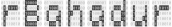

 

<!-- badges: start -->
[](https://cran.r-project.org/package=rBahadur)
[](https://zenodo.org/badge/latestdoi/531716870)

<!-- badges: end -->

> Efficient simulation of genotype / phenotype data under
> assortative mating by generating Bahadur order-2
> multivariate Bernoulli distributed random variates.

## Features

* Multivariate Bernoulli (MVB) distribution samplers
  * `rb_dplr`: generate Bahadur order-2 MVB variates with diagonal-plus-low-rank (DPLR) correlation structures
  * `rb_unstr`: generate Bahadur order-2 MVB variates with arbitrary correlation structures
* Assortative mating  modeling tools
  * Compute equilibrium parameters under univariate AM
    * `h2_eq`: compute equilibrium heritability
    * `rg_eq`: compute equilibrium cross-mate genetic correlation
    * `vg_eq`: compute equilibrium genetic variance
  * Generate genotype / phenotype data given initial conditions
    * `am_simulate`: complete univariate genotype / phenotype simulation
    * `am_covariance_structure`: compute outer-product covariance component for AM-induced DPLR covariance structure
  * Genotype input / output
    * `write_genotypes`: write genotypes as int8 or PLINK bed
    * `read_genotypes`: read genotypes back into an R matrix
  * Realistic local LD
    * `am_mosaic`: combine AM-induced global LD with recombination-induced local LD
    * `kg_reference`: bundled 1000 Genomes reference panel
    * `vcf_to_panel`, `download_1kg_panel`: build panels from real data
* Command line interface
  * `rbahadur simulate`: stream a simulation to disk without opening R
  * `rbahadur info`: inspect an existing run and verify it is intact


## Installation

`rBahadur` is now on CRAN:

```r
install.packages("rBahadur")
```

Alternatively, you can install directly from github using the `install_github` function provided by the [`remotes` library](https://github.com/r-lib/remotes):

```r
remotes::install_github("border-lab/rBahadur")
```

## Usage

Here we demonstrate using `rBahadur` to simulate genotype / phenotype at equilibrium under AM: given the following parameters:

 - `h2_0`: panmictic heritability
 - `r`: cross-mate phenotypic correlation
 - `m`: number of diploid, biallelic causal variants
 - `n`: number of individuals to simulate
 - `min_MAF`: minimum minor allele frequency
 
 ```r
set.seed(2022)
h2_0 = .5; m = 2000; n = 5000; r =.5; min_MAF=.05

## simulate genotype/phenotype data
sim_dat <- am_simulate(h2_0, r, m, n)
```

The equilibrium variance and heritability formulas are large-locus results.
Simulations with fewer than 50 causal variants are still allowed, but emit a
warning because their realized values can differ materially from those targets.
After deciding that this finite-locus approximation is appropriate, suppress
the warning with `options(rBahadur.warn_small_m = FALSE)`.

We compare the target and realized allele frequencies:

```r

## plot empirical first moments of genotypes versus expectations
afs_emp <- colMeans(sim_dat$X)/2
plot(sim_dat$AF, afs_emp)
```

We compare the expected equilibrium heritability to that realized in simulation: 

```r

## empirical h2 vs expected equilibrium h2
(emp_h2 <- var(sim_dat$g)/var(sim_dat$y))
h2_eq(r, .5)
```

Negative values of `r` correspond to disassortative mating, which reduces
genetic variance rather than inflating it:

```r
neg <- am_simulate(h2_0, r = -.3, m, n)
var(neg$g)
vg_eq(-.3, h2_0, h2_0)
```

For simulations too large to hold in memory, supply `path` to stream genotypes
to disk one batch at a time:

```r
p <- file.path(tempdir(), "am_sim")
meta <- am_simulate(h2_0, r, m = 2e4, n = 5e3, path = p, format = "variant")
X <- read_genotypes(p)
```

## Reading the output into Python

The `individual` and `variant` layouts are flat `int8`, one byte per genotype
with values 0, 1, and 2, so no library beyond `numpy` is needed. The companion
`<prefix>.meta` is plain text and carries the dimensions and the layout:

```
rBahadur_genotypes: 1
format: individual
n: 5000
m: 20000
dtype: int8
```

That is everything required to read the file:

```python
import numpy as np

def read_meta(prefix):
    meta = {}
    with open(prefix + ".meta") as f:
        for line in f:
            key, _, value = line.partition(":")
            meta[key.strip()] = value.strip()
    return meta

def read_genotypes(prefix, mmap=False):
    meta = read_meta(prefix)
    n, m = int(meta["n"]), int(meta["m"])
    if meta["format"] == "bed":
        raise ValueError("bed is 2-bit packed; see the PLINK section below")
    if mmap:
        a = np.memmap(prefix + ".int8", dtype=np.int8, mode="r")
    else:
        a = np.fromfile(prefix + ".int8", dtype=np.int8)
    # individual-major is already (n, m); variant-major is stored transposed
    return a.reshape(n, m) if meta["format"] == "individual" else a.reshape(m, n).T

X = read_genotypes("am_sim")          # (n, m), individuals by variants
```

The default `individual` layout stores each person's variants contiguously, so
it maps onto a C-ordered `(n, m)` array with no transpose and no copy. Pass
`mmap=True` to leave the file on disk and page it in on demand, which is the
point of writing `int8` in the first place: a 5,000 by 20,000 matrix is 100 MB
as `int8` against 800 MB as doubles.

For the `bed` layout, use an existing PLINK reader. Note that `pandas_plink`
counts the opposite allele by default and will silently return `2 - X`, so pass
`ref="a0"` to get the dosages `rBahadur` actually wrote:

```python
from pandas_plink import read_plink1_bin

G = read_plink1_bin("sim.bed", "sim.bim", "sim.fam", ref="a0", verbose=False)
X = G.values                          # (n, m), matches read_genotypes() in R
```

`write_genotypes()` has no marker annotations, so its `.bim` uses documented
placeholders. In contrast, `am_mosaic(..., format = "bed")` preserves the
reference panel's available chromosome, base-pair position, genetic map,
marker ID, and allele fields.

One caveat: the `<prefix>.rds` sidecar holding allele frequencies, effect
sizes, and phenotypes is an R object and is not readable from Python. If the
downstream analysis lives in Python, write those out in a portable format too:

```r
out <- am_simulate(h2_0, r, m, n, path = p, format = "individual")
write.csv(data.frame(y = out$y, g = out$g), paste0(p, "_pheno.csv"),
          row.names = FALSE)
write.csv(data.frame(AF = out$AF, beta_std = out$beta_std,
                     beta_raw = out$beta_raw),
          paste0(p, "_variants.csv"), row.names = FALSE)
```

Reference panels should be built from phased VCFs. `vcf_to_panel()` accepts
unphased calls so exploratory workflows are not blocked, but warns that the
written allele order will be treated as phase and may create artificial
haplotypes and local LD. `download_1kg_panel()` additionally requires `curl`,
`zcat` (from gzip), and `awk`.

## Command line interface

For generating data outside an R session, the package ships an `rbahadur`
executable. Put it on your path with:

```bash
ln -s $(Rscript -e "cat(rBahadur::rbahadur_cli_path())") ~/bin/rbahadur
```

`rbahadur simulate` streams straight to disk, so it never holds the genotype
matrix in memory:

```bash
rbahadur simulate --h2 0.5 --r -0.3 --m 200 --n 1001 \
                  --out run1 --format bed --seed 7 --csv
```
```
wrote run1.bed (49 Kb)
  1001 individuals x 200 variants, format bed
  equilibrium h2 0.4673, genetic variance 0.4385
  also wrote run1_pheno.csv and run1_variants.csv
```

`--seed` makes a run reproducible, and `--csv` adds `_pheno.csv` and
`_variants.csv` alongside the R-only `.rds`, which is what you want when the
downstream analysis is in Python. Run `rbahadur --help` for the full list.

`rbahadur info` reports what a prefix contains and checks the data file
against its metadata, which catches a truncated transfer:

```bash
rbahadur info run1
```
```
prefix    run1
format    bed
dtype     bed2bit
n         1001 individuals
m         200 variants
data      run1.bed
size      50203 bytes actual, 50203 expected
status    ok
```

Exit status is `0` on success, `1` for a usage error such as a misspelled
option, and `2` when a run starts and then fails, for example when the
requested disassortative `r` falls outside the Bahadur feasible region. That
split lets a calling script tell a typo from a genuine modelling failure.

## Citation

Developed by [Richard Border](https://www.richardborder.com) and [Osman Malik](https://osmanmalik.github.io/). For further details, or if you find this software useful, please cite:
 - Border, R. and Malik, O.A., 2023. `rBahadur`: efficient simulation of structured high-dimensional genotype data with applications to assortative mating. _BMC Bioinformatics_, 24, 314. https://doi.org/10.1186/s12859-023-05442-6

## Background reading:

 - The Multivariate Bernoulli distribution and the Bahadur representation:
   - Teugels, J.L., 1990. Some representations of the multivariate Bernoulli and binomial distributions. _Journal of Multivariate Analysis_, 32(2), pp.256-268. https://doi.org/10.1016/0047-259X(90)90084-U
   - Bahadur, R.R., 1959. A representation of the joint distribution of responses to n dichotomous items. _School of Aviation Medicine, Randolph AFB, Texas_. https://apps.dtic.mil/sti/citations/AD0706093
 - Cross-generational dynamics of genetic variants under univariate assortative mating:
    - Nagylaki, T., 1982. Assortative mating for a quantitative character. _Journal of Mathematical Biology_, 16, pp.57–74. https://doi.org/10.1007/BF00275161
